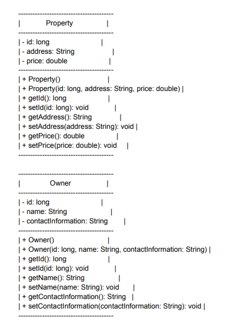
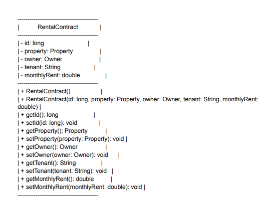

# - TP 7 Développement d'API avec Spring Boot à partir d'un Diagramme de Classes

Ensemble d'API RESTful utilisant Spring Boot, en  basant sur un diagramme de classes décrivant les
entités et les relations principales du système. 

## Tools and technologies used
• Java 17 
 • Gradle 
 • Spring Boot 3 
 • Spring Web 
 • Spring Security 6 
 • Spring Data JPA
 • Swagger
 • Mysql
 • Lombok
s
## Tasks
• Implémentation des contrôleurs REST pour les entités principales du diagramme de
classes. Chaque entité a ses propres opérations CRUD (Create, Read,
Update, Delete). 

• Configuration la couche de persistance pour interagir avec une base de données
(Mysql). 

• Test les différentes API à l'aide de Postman et via des tests unitaires
pour garantir leur bon fonctionnement. 

•Documentez vos API en utilisant Swagger pour faciliter leur utilisation par d'autres développeurs

